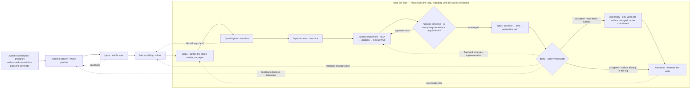

# Delivery workflow

For one small vertical slice:

1. Write or refine the behaviour specification.
2. Run `/gaps` over what that produced, while a missing state is still a paper edit.
3. Create or resume `plan.md` and `tasks.md` with the Spec Kit commands installed by `./delivery/init`.
4. Implement each task RED-GREEN-REFACTOR, keeping `make verify` green.
5. Run the installed Spec Kit converge command, implement whatever it appends, and repeat until it reports
   converged or reaches its bound; then `/gaps` over the slice diff.
6. Demonstrate the actor-visible path and pause for feedback.
7. After acceptance, run `/mutation` and `make verify` — and `/adversary` first, when the slice changed
   attack surface or closed the split.

The principles stage has a gate of its own. `.specify/memory/constitution.md` is what every stage after it
treats as the authority, so `make check-constitution` fails the build when that file stops carrying minimum
CD, the practices the skills in `delivery/skills/` teach, or the obligations this project's capabilities claim — and
`.specify/extensions.yml` hooks `/speckit-constitution` on both sides so the drafting session sees the
required coverage before writing and the check runs immediately after. `/constitution-coverage` prints the
normative text at any time. Until that stage has been started the gate stands aside: `./delivery/init` installs the
template, and the untouched template passes, so the walking skeleton reaches `main` — and production, where
there is a target — before the first principle is written. It applies from the first edit, and from the first
feature under `specs/` whether or not the constitution was touched.

Three stages in the loop are deliberately not the shape they look like. **Converge** is append-only — its
only write is new tasks — so it is safe to repeat until it reports converged or reaches its bound, and it is what makes the demo
worth showing. The **second `/gaps`** runs after that verdict rather than before it, because ahead of
converge every unbuilt task reads as a gap and buries the findings that need judgement. **`/adversary`** is
an end-of-phase pass rather than a per-slice one: `delivery/commands/adversary.md` runs it when the diff changed
attack surface and at the close of the split regardless, and records the decision either way in
`specs/<feature>/adversary-log.md` — which is what lets a later slice decline on evidence instead of
judgement. The trigger table is in that row before any spawn. `/mutation` still runs on every accepted slice, and when both run adversary goes first, since it
adds tests and mutation measures whatever exists when it runs.

`/drive` owns resumption and sequencing, and is safe to call at any point on this diagram: it enters at the
first stage still owing an artifact, stepping back out of the loop when an upstream stage has not been done.
Demo feedback returns to the stage that owns the change before the path is demonstrated again. A real product decision is a stop; finishing an intermediate document is
not.

`/cruise` runs this same diagram with nobody at the wheel. A product decision is answered by `drive-skipper`
and written in `specs/<feature>/decisions.md`; the demo is run by `drive-hand` and written in the slice's
`demo-log.md`; the run ends only when the specification is satisfied, or when a person stops it. What each
stage produces does not change. `delivery/commands/cruise.md` is exact.
